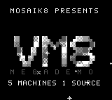
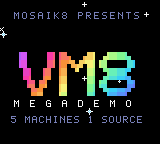
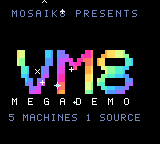
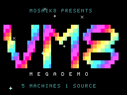
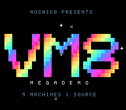

# MosaiK8

**MosaiK8** is a framework for retro console development built around **mosaik**,
a modern, high-level programming language. The mosaik compiler has **two C
backends** — GBDK and cc65 — that together target **nine consoles (Game Boy / Color / Pocket / Mega Duck, SMS, Game Gear, NES and Atari Lynx, PC Engine) from one
language and one set of source files**.

**join our Discord:** https://discord.gg/BtYaF6Ydwr

<div align="center">
<table>
<tr>
<td align="center"><br><sub>Game Boy</sub></td>
<td align="center"><br><sub>Game Boy Color</sub></td>
<td align="center"><br><sub>Game Gear</sub></td>
</tr>
</table>
<table>
<tr>
<td align="center"><br><sub>Master System</sub></td>
<td align="center"><br><sub>PC Engine</sub></td>
</tr>
</table>
</div>

*[`projects/vm-megademo`](projects/vm-megademo): one source tree, five
consoles - a seven-part demo directed by VM8 event scripts.*

## ⚡ Quickstart

You need **Python 3.7+** and **git**. Everything else is fetched by `setup_tools.py`.

```bash
# 1. Get the code
git clone https://github.com/SiENcE/mosaik8.git
cd mosaik8

# 2. Fetch the toolchains (GBDK-2020, cc65), test emulators and Python packages
python setup_tools.py

# 3. Build a sample (an animated player and a pacing enemy)
python mosaik8.py build --platform gameboy projects/vm-clipdemo
```

The ROM lands in `projects/vm-clipdemo/build/gameboy/vm-clipdemo.gb`. Pass a
different `--platform` to build the same project for another console, for
example `gameboy_color` (`.gbc`), `sms` (`.sms`) or `lynx` (`.lnx`). Leave
`--platform` out to build every console in the project's `target_platforms`.

Next: see [Start a project](#-start-a-project) below.

## The Backends

- **GBDK backend** (default) — emits GBDK C, linked by the GBDK-2020
  toolchain (`lcc`/`sdcc`) into Game Boy, Game Boy Color, Analogue Pocket,
  Mega Duck, Sega Master System, Game Gear, and NES ROMs.
- **cc65 backend** — emits cc65 C, linked by cc65 (`cl65`) into
  Atari Lynx (`.lnx`) and PC Engine (`.pce`) ROMs.

The lexer, parser, type-checker, and all logic codegen are shared; only the
prelude and standard-library lowering differ per backend. Programs that stay
within the portable stdlib subset (text, input, timing, sound, sprites,
background, palettes) build for every console unchanged.

> Naming: the framework/CLI is **MosaiK8**; the language is **mosaik**.
> `.mos` = source · `.c` = generated intermediate · `.gb`/`.gbc`/`.pocket`/
> `.duck`/`.sms`/`.gg`/`.nes` = GBDK ROMs · `.lnx`/`.pce` = cc65 ROMs.

## Requirements

- **Python 3.7+** with the `toml` package (developed and tested on 3.12; on
  3.11+ the standard library's `tomllib` is used where it is available)
- **GBDK-2020** — for the GBDK consoles (installed by `setup_tools.py`)
- **cc65** — for the Atari Lynx / PC Engine targets (installed by `setup_tools.py`)
- *(optional, for verification)* **PyBoy** (Game Boy ROMs) and **libretro.py + cores**
  (Lynx / PCE / SMS / GG / NES)

### One-shot setup

`setup_tools.py` downloads and installs everything into the folders the build
tool expects (all gitignored):

```bash
python setup_tools.py            # install everything that is missing
python setup_tools.py --check    # report what is installed, change nothing
python setup_tools.py --only gbdk,cc65     # just the toolchains
python setup_tools.py --only cores,python  # just the test emulators
python setup_tools.py --force    # reinstall even if already present
python setup_tools.py --check --json       # machine-readable status (the studio's setup wizard)
python setup_tools.py --prefix DIR         # install into DIR instead of beside this file
```

`--prefix` defaults to `$MOSAIK8_HOME`, else the checkout. It is where an
installed (frozen) studio puts its toolchains, since it cannot write into its
own tree; `mosaik8.py` looks there too (see the search order below).

Everything below is **fetched from its official source onto your machine and
never bundled** with MosaiK8: this repository contains none of it, and each
piece stays under its own licence.

| Component | Installs | Licence | Used for |
| --- | --- | --- | --- |
| `gbdk` | GBDK-2020 (latest GitHub release) → `gbdk/` | GPLv2 + linking exception (SDCC runtime: GPL + exception) | building all GBDK-backend consoles |
| `cc65` | cc65 Windows snapshot → `cc65/` | zlib | building Atari Lynx / PC Engine |
| `cores` | Handy, Beetle Lynx, Holani (Lynx), Beetle PCE Fast, Genesis Plus GX (SMS/GG), FCEUmm (NES) → `emu/libretro/` | Handy zlib · Beetle Lynx / Beetle PCE Fast / FCEUmm GPLv2 · Holani GPL-3.0 · **Genesis Plus GX non-commercial** | headless Lynx/PCE/SMS/GG/NES testing |
| `python` | `pyboy`, `libretro.py`, `pillow`, `toml` (pip into site-packages) | PyBoy LGPL-3.0 · libretro.py MIT · Pillow MIT-CMU · toml MIT | build tool + emulator harnesses, in a checkout |
| `pylibs` | `pyboy`, `libretro.py` as wheels → `pylibs/` | as `python` | the same for an installed studio with no pip |

Genesis Plus GX's licence forbids commercial use; it is only a test emulator
here and nothing you build depends on it.

Notes:
- `python` and `pylibs` are alternatives, not a pair: a bare run picks `python`
  in a checkout and `pylibs` under `--prefix` / `$MOSAIK8_HOME`.
- cc65 binary snapshots exist for Windows only, so off Windows a bare run
  SKIPS it (`--check --json` reports it as not fetchable, with the reason);
  install cc65 from your package manager and set `CC65_HOME`.
- The Beetle Lynx core needs the real Lynx boot ROM (`lynxboot.img`, 512 bytes,
  copyrighted — not downloadable). Drop it into `emu/libretro/` yourself;
  without it the harness falls back to the Handy core, which boots homebrew
  BIOS-less.

### Pointing at your own toolchains

If you already have GBDK-2020 or cc65 installed elsewhere, set an environment
variable instead of running the installer:

```bash
# Windows (PowerShell)
$env:GBDK_HOME = "C:\path\to\gbdk-2020"   # for GBDK consoles
$env:CC65_HOME = "C:\path\to\cc65"        # for Lynx / PC Engine

# Linux / macOS
export GBDK_HOME=/path/to/gbdk-2020
export CC65_HOME=/path/to/cc65
```

Search order per toolchain (`mosaik8_build.py` `find_gbdk` / `find_cc65`):
the `GBDK_HOME`/`CC65_HOME` env var → `$MOSAIK8_HOME/gbdk` or
`$MOSAIK8_HOME/cc65` (the `setup_tools.py --prefix` location) → a
`gbdk-2020/`/`gbdk/` or `cc65/` folder next to `mosaik8.py` (what
`setup_tools.py` creates in a checkout; GBDK also tries the current directory
and a few common system paths) → the system `PATH` (`lcc` / `cl65`).

## Start a project

### 1. Initialize a new project

```bash
python mosaik8.py init my_game
cd my_game
```

This creates `my_game/mosaik.toml` + `my_game/src/main.mos`.

### 2. Write your first game

A minimal portable program: an `@` you move with the D-pad. It builds for all
nine consoles unchanged, because text works in character cells and
`SCREEN_COLS` / `SCREEN_ROWS` are each console's own size:

```mosaik
module "main" {
    import "platform.video"
    import "platform.input"
    import "platform.system"
    import "graphics.text"

    var x: u8 = 4
    var y: u8 = 4

    function main() {
        video.enable_lcd()
        text.print_string(1, 1, "MOVE THE @")
        loop {
            text.print_string(x, y, " ")                -- erase
            if input.pressed(INPUT_LEFT)  and x > 0               { x -= 1 }
            if input.pressed(INPUT_RIGHT) and x < SCREEN_COLS - 1 { x += 1 }
            if input.pressed(INPUT_UP)    and y > 3               { y -= 1 }
            if input.pressed(INPUT_DOWN)  and y < SCREEN_ROWS - 1 { y += 1 }
            text.print_string(x, y, "@")                -- draw
            system.delay(80)
            video.wait_vblank()
        }
    }

    export main
}
```

The full language is documented in
[`docs/mosaik_lang_spec.md`](docs/mosaik_lang_spec.md).

### 3. Build and run

```bash
# Build every console in target_platforms (uses mosaik.toml in the current
# directory; `init` sets Game Boy + Game Boy Color)
python mosaik8.py build

# ...or any other supported console
python mosaik8.py build --platform gameboy_color
python mosaik8.py build --platform nes
python mosaik8.py build --platform lynx samples/hello.mos

# ...or every supported console at once (single-file mode only)
python mosaik8.py build --all-platforms samples/hello.mos

# MosaiK8 has no `run` command — open the built ROM in an emulator directly:
pyboy samples/build/gameboy/bounce.gb                        # Game Boy
python emu/libretro/run_lynx.py samples/build/lynx/hello.lnx # Atari Lynx (headless)
```

Supported `--platform` values: `gameboy`, `gameboy_color`, `analogue_pocket`,
`megaduck`, `sms`, `gamegear`, `nes` (GBDK backend), and `lynx`, `pce` (cc65
backend). A program that stays within the portable stdlib subset builds for all
nine unchanged — size the world with the per-target `SCREEN_WIDTH`/`SCREEN_HEIGHT`
constants and it *behaves* right everywhere too. Gate non-portable code with
`if platform == "..."`.

## Build Modes

The build tool has exactly two modes — there is **no "scan the whole tree" mode**.

- **Single-file mode** — `build <file.mos>`: a `build/` folder is created next to
  the file, and the generated `.c`/ROM are named after the source. Transitive
  non-stdlib imports are pulled in automatically.
  ```bash
  python mosaik8.py build samples/bounce.mos
  python mosaik8.py build --platform gameboy samples/pong.mos
  ```
- **Project mode** — `build <mosaik.toml>` (or a directory containing one, or
  nothing for `./mosaik.toml`): compiles every `.mos` under `[source] folder`
  into one program and builds each `target_platforms` console.
  ```bash
  python mosaik8.py build projects/game        # directory containing mosaik.toml
  ```

Other commands: `clean` (removes the project-mode `build/`), `init`, `version`.
Add `--debug` for `lcc` debug symbols. See the build-system section of the
[language spec](docs/mosaik_lang_spec.md) for the full CLI and `mosaik.toml`
reference.

## Configuration (`mosaik.toml`)

```toml
[project]
name = "my_game"                              # names the output .c and ROM
target_platforms = ["gameboy", "lynx", "pce"] # any of the nine

[source]
folder = "src/"                               # where .mos sources live

[assets]
sprites = ["assets/sprites.png"]              # PNGs → tile data at build time

[build]
output_dir = "build"
rom_size = "64KB"                             # GB family only: cart geometry (banking)
ram_size = "8KB"                              # GB family only
```

That is a minimal file. Every key the build acts on, including the `[build]`
knobs for banking, the Lynx budgets and the VM8 runtime, is listed in §5.1 of
the [language spec](docs/mosaik_lang_spec.md) and, with defaults, in the
[cheat sheet](docs/cheat-sheet.md) Part 6. Anything else prints a `⚠️` warning
so typos don't pass silently. Platform names accept aliases
(`atari_lynx` → `lynx`, `pc_engine` → `pce`, …).

## Samples & Tests

The `samples/` folder holds ready-to-build programs (`hello`, `bounce`, `pong`,
`beep`, `banked`, `colors`, `metasprite`, `cross_platform`, …); full projects
live in `projects/` (`game`, `shmup`, `background`, `colorlab`,
`game-slice`, …). The `vm-*` projects are **VM8** games — logic authored as
event lists (`scripts/*.evt.toml`) compiled to a bytecode blob
(`python -m mosaik_vm scripts -o src/scripts.mos`); many carry a `verify.py`
that asserts their behaviour headlessly on the Python reference interpreter
(`mosaik_vm/refvm.py`) and, where emulators are installed, on the real ROM.
Build any sample in single-file mode and any project in project mode:

```bash
python mosaik8.py build samples/bounce.mos   # → samples/build/<console>/bounce.*
python mosaik8.py build projects/shmup       # → projects/shmup/build/<console>/starfall.*
```

Run the test suite:

```bash
python tests/run_all.py            # unit tests
python tests/run_all.py --samples  # also build every sample × console + the projects
python tests/verify_roms.py        # behavioural checks (PyBoy; --lynx/--pce/--sms/--gg/--nes add cores)
```

`run_all.py` exits non-zero on any failure, so it is suitable for CI. ROM
verification (PyBoy + the libretro harness) is documented in the
[language spec](docs/mosaik_lang_spec.md#56-testing-roms).

## 🎮 Features

- **Nine consoles, one source** — Game Boy / Color / Pocket / Mega Duck, SMS,
  Game Gear, NES (GBDK) and Atari Lynx, PC Engine (cc65).
- **Modern syntax** — Lua/Python-flavoured surface over an 8/16-bit type system:
  structs, enums, modules, control flow, first-class function pointers
  (callbacks), and the portable stdlib compile identically everywhere.
- **Capability gating** — calling a stdlib function a console lacks is a clear
  compile-time error, not a silent no-op or link failure.
- **Standard library** — video, input, sound (a portable beep + tone on all
  nine; a per-console second voice, and the `hw.psg` port primitive for the SN76489),
  sprites + metasprites, scrollable background tilemap, window (GB
  family), draw primitives (Lynx), and `graphics.palette` (the 4-colour GB
  palette model on every console, degrading to greys on the 4-grey machines).
- **Music** — an opt-in native multi-channel driver (`lib/vm/music.mos`) plays a song
  authored as DATA across each chip's real channels: Game Boy family (pulse + wave +
  noise), Atari Lynx (Mikey), and SMS / Game Gear (SN76489), leaving a channel free
  for SFX. Byte-identical when a game uses no audio.
- **Asset pipeline** — PNGs listed in `mosaik.toml` (or `--asset`) become tile
  data on every console; a sidecar `*.sprites.toml` slices a sheet into named
  sub-sprites ready for `sprite.set_meta`.
- **ROM banking** — `bank(N)` places functions in MBC5 banks to grow past 32 KB
  on the Game Boy family (the Sega mapper on SMS/GG, UNROM on the NES).
  `[build] code_banks` banks whole modules there too, maps real ROM banks on
  the PC Engine (HuCards up to 1 MB) and turns them into cart overlays on the
  Lynx, where `hot` keeps a per-frame function resident.
- **Game framework** — reusable `lib/` modules (scenes, follow camera,
  collision — incl. a paintable per-cell **collision layer** decoupled from the
  visual tile, with one-way platforms — dialogue, HUD, callback-driven animation,
  genre kits) for building multi-room games.
- **VM8** — a **bytecode VM** runtime (`lib/vm/`) implementing the VM8
  specification (`docs/vm8-spec.md`): game logic is event-script DATA
  (`scripts/*.evt.toml` → a compiled bytecode blob via `python -m mosaik_vm`)
  run by one fixed native engine, so an edit re-compiles data, not a game loop.
  Threads take arguments and are joinable through heap handles, scene change /
  reset / load are one RAISE exception mechanism, and expressions include the
  bitwise group. Opt-in native packs (player / scenes+doors+triggers /
  per-instance entity slots / top-down combat + HUD / projectiles) run at
  engine speed while scripts orchestrate - including the per-frame
  player-vs-actor overlap that fires an actor's On Hit, the platformer
  knockback impulse, and script-pinned animation states. Later packs add
  ANGLE-AIMED projectiles (`vm.trig` + an `atan2` RPN token, flight in
  sixteenths of a pixel), ladders, emote bubbles,
  and persistent SRAM save/load. Runs on all consoles but the NES.
- **Text & UI** — dialogue/menu boxes with GB Studio's own geometry, a
  typewriter reveal, and two font models: a resident console font, or
  `text.glyph_buffer`, which keeps the font in ROM and rasterizes glyphs on
  demand into a derived band so a scene can use nearly the whole tile table.
  **Variable-width text** rides the same band, keyed on the font's own width
  marker. On the GB family a box sits on the hardware window layer; on SMS/GG,
  which have none, it is plotted in screen space with the scroll snapped to a
  tile and the camera held.
- **Colour tiers** — per-tile background palettes, 4bpp background and sprite
  tiers (PCE and SMS/GG always, Lynx opt-in), per-frame sprite palettes, and
  **scanline parallax** bands over an LYC/STAT interrupt with per-band column
  streaming.
- **Raster effects** — `bkg.raster*`, a per-scanline scroll table (one scroll
  per screen line: pseudo-3D roads, ripples, "mode 7" floors) on the Game Boy
  family and SMS / Game Gear, and `system.cpu_fast` for the Game Boy Color's
  double-speed CPU. `projects/raster-lab` proves the table on a rendered frame
  and `projects/mosaik-kart` is a kart racer built on it.
- **Batch sprite verbs** - `sprite.plot` / `drift` / `hit_box` / `hit` move,
  draw and collision-test a whole pool of bullets in one native loop over
  plain byte arrays (assembly on the Game Boy family and SMS / Game Gear).
  `projects/batch-lab` proves them on running ROMs and `projects/vm-raid` is
  a VM8-directed shooter built on them.
- **Capacity levers** — per-scene tilesets, metatile map packing, a paint
  interpreter, per-room sprite residency, and `[world] stream` cart
  streaming/banking, so a game can outgrow any one console's resident image.
  Per-object descriptor metasprites when a kind needs GB Studio's real
  placement model.
- **Audio choices** — the portable native driver above, or **hUGEDriver**
  (`native.huge`) on the GB family for hUGETracker parity, both behind one
  seam; a data-driven SFX library; hUGETracker `.uge` modules import directly.
- **Frame pacing** — `[build] frame_lock = N` holds a game frame to N display
  frames, which is what makes a converted game's durations mean the same thing
  in every room (a VM frame is NOT a fixed number of display frames).
- **One-shot setup** — `setup_tools.py` downloads the toolchains and test
  emulators for you.

## 📚 Documentation

- **[`docs/mosaik_lang_spec.md`](docs/mosaik_lang_spec.md)** — the language: syntax,
  types, modules, the build system, the full standard-library reference, and the
  per-console support matrix. *Start here to write mosaik.*
- **[`docs/game-framework.md`](docs/game-framework.md)** — the game framework that
  sits on top of mosaik: scenes, actors, collision, camera, dialogue, HUD, genre
  loops, and a how-to for adding a new genre. *Start here to build a game.*
- **[`docs/vm8-spec.md`](docs/vm8-spec.md)** — the **VM8 specification**: the
  bytecode virtual machine `lib/vm/` implements and `mosaik_vm/` compiles for —
  machine state, binary format, the instruction set, the RPN evaluator,
  scheduler, waitables, exceptions, and the conformance vectors. *Start here to
  build a script-driven (event-list) game or to hack on the VM.*
- **[`docs/vm8-playground.html`](docs/vm8-playground.html)** — the VM8
  reference playground: an assembler + interpreter in JavaScript, in one
  self-contained page (open it in a browser).
- **[`docs/vram-layout.md`](docs/vram-layout.md)** — the per-console VRAM layout
  the graphics stdlib assumes.
- **[`docs/cheat-sheet.md`](docs/cheat-sheet.md)** — every hard number a game
  author hits, per console (tiles, sprites, palettes, the VM8 pools, cart and
  bank-0 sizes, the Lynx buffers, audio), each with the file that owns it.
- **[`docs/capacity-and-limits.md`](docs/capacity-and-limits.md)** — why those
  limits exist, what to do when you reach one, and how big a *world* fits (the
  streaming / paint-interpreter / metatile residency levers).
- **[`docs/vm8-vs-gbvm.md`](docs/vm8-vs-gbvm.md)** — VM8 set against gbvm, GB
  Studio's virtual machine: the same bet (a fixed engine, the game as data)
  and the places where VM8 deliberately took a different trade.
- **[`docs/vm8-vs-gbstudio.html`](docs/vm8-vs-gbstudio.html)** — MosaiK8's hard
  numbers per console, next to GB Studio's (open it in a browser).

## Troubleshooting

- **`GBDK tool 'lcc' not found`** — run `python setup_tools.py --only gbdk`, or
  set `GBDK_HOME` to an existing install, or add GBDK's `bin/` to your `PATH`.
- **`'charmap' codec can't decode byte ...`** — a `.gb` ROM was treated as a
  source file. Source files must use the `.mos` extension.
- **ROM too large** — on the Game Boy family, move functions into ROM banks with
  `bank(N)` and/or set `[build] rom_size` (see the spec's ROM-banking section).

## Contact

**X/Twitter**: https://x.com/Elliptic_FloW
**Discord:** https://discord.gg/BtYaF6Ydwr
**create an Issue** https://github.com/SiENcE/mosaik8/issues

## Contributing

1. Fork the repository
2. Create a feature branch
3. Make your changes
4. Add tests if applicable
5. Submit a pull request

## License

This project is licensed under the MIT License — see the LICENSE file for details.
Third-party work it contains, derives from or links, with each licence, is in
[`THIRD_PARTY_NOTICES.md`](THIRD_PARTY_NOTICES.md).

**ROMs you build.** The runtimes MosaiK8 links into a ROM (GBDK-2020 / SDCC with
their linking exceptions, cc65's zlib runtime, the public-domain hUGEDriver)
generally permit proprietary ROMs, subject to their licence terms and to those
of every other piece of code, art and music you put into the game. A ROM that
uses variable-width text contains code derived from CrossZGB (MIT), whose
notice must accompany it (see `THIRD_PARTY_NOTICES.md`; the generated C carries
it too).

## Acknowledgments

- **gbvm** — the inspiration for the design of VM8
- **hUGETracker / hUGEDriver** (SuperDisk) — the music format and driver,
  public domain
- **CrossZGB** — the variable-width text renderer is derived from its
  `vwf_print_render`
- **Pan Docs** — the Game Boy hardware reference
- **GBDK-2020 Team** — the multi-console development kit
- **cc65 Team** — the toolchain powering the Atari Lynx and PC Engine backend
- **libretro / Handy / Beetle** — the cores powering headless testing
- **Retro Development Community** — resources and inspiration across all platforms
- **Lua and Python Communities** — syntax inspiration

---

Copyright (c) 2026 Florian Fischer
